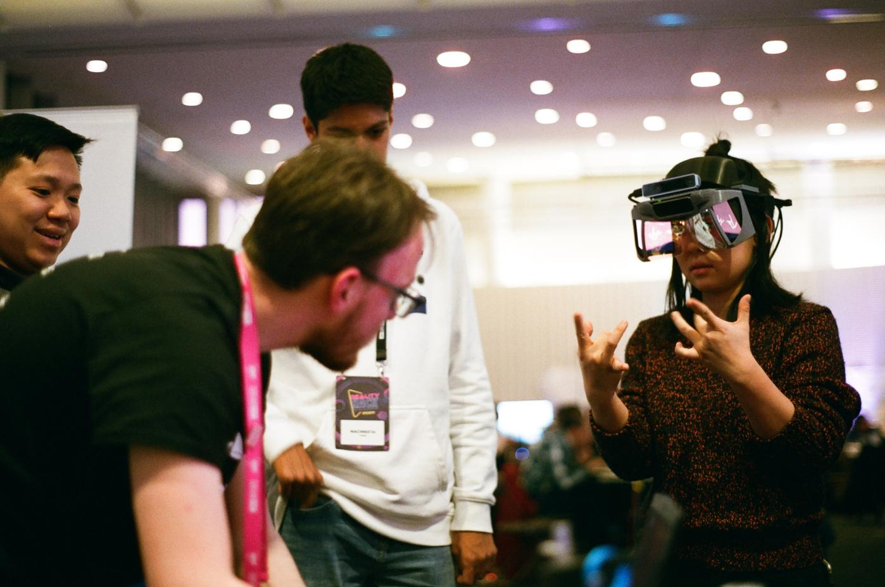
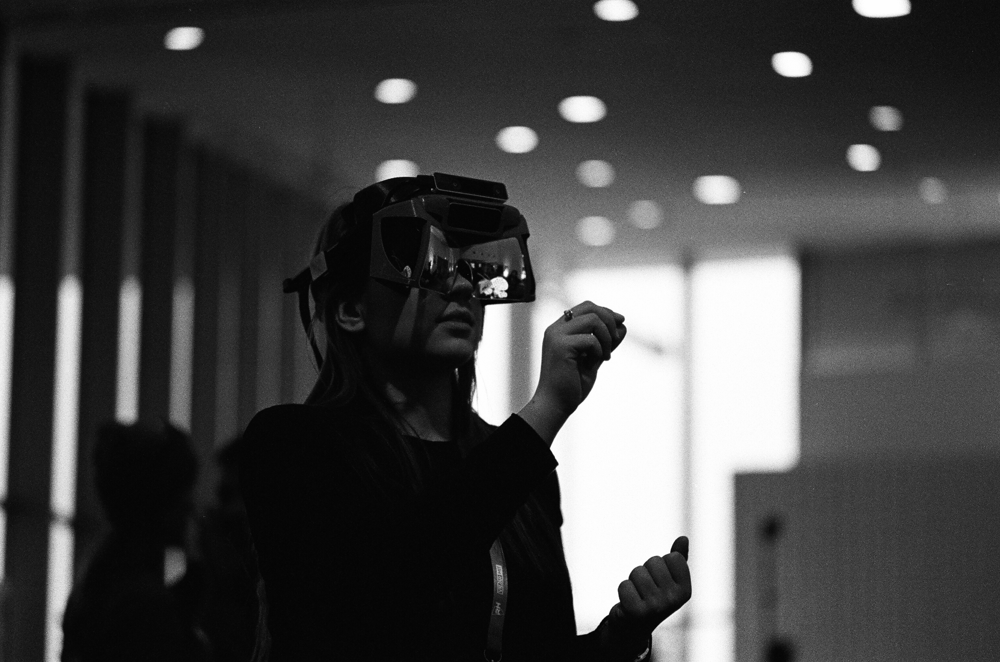

# Project Northstar

## Welcome to the [Community Built Documentation](https://project-north-star.gitbook.io/project-north-star/) for Project North Star!

> _We envision a future where the physical and virtual worlds blends together into a single magical experience. At the heart of this experience is hand tracking, which unlocks interactions uniquely suited to virtual and augmented reality._ \
> \
> _To explore the boundaries of interactive design in AR, we created and open sourced Project North Star, which drove us to push beyond the limitations of existing systems."_\
> \
> _-Leap Motion_

Project North Star is an open-source Augmented Reality headset originally designed by LeapMotion (now UltraLeap) in June 2018. The project has had many variations since its inception, by both UltraLeap and the open-source community. Some of the variations are documented and linked to here but visit the discord server for more to-the-moment information. The headset is almost entirely 3D printable, with a handful of components like reflectors, circuit boards, cables, sensors, and screws that need to be sourced separately.&#x20;

##  &#x20;

**Project North Star at MIT Reality Hack 2020**, photo credit: [Matthew Daiter](https://daiter.dev/)

There's also a large community of Northstar developers and builders on Discord, you can join the server and share your build, ask questions, or get help with your projects by [joining the server](https://discord.gg/9TtZhb4)

For a more detailed look into the project, checkout our **General FAQ**, or Mechanical pages.&#x20;


[faq.md](getting-started/faq.md)


## Variations

Project North Star has seen its fair share of revisions and updates since the original open-source files were released. To clear up any ambiguity from the outset, **Release 1** was an internal release. **Release 2**, the first public open-source release (sometimes referred to as the **initial release**), was in 2018. **Release 3** came in 2019 and improved on the mechanical design in many ways. The Deck X innovated on this and provided an integrated circuit board to reduce cables from the headset to just two, (USB 3 / mini-DP), by combining USB devices into a custom-built USB hub + Arduino module. As shown from the table below, the newly released **Northstar Next** is probably what new users will want to start with, it has an emphasis on modularity and affordability.

<table data-header-hidden><thead><tr><th width="168">Name</th><th width="111">Status</th><th width="136">Date</th><th width="162">Developer</th><th width="136">Spatial Tracking</th><th width="141">Hand Tracking</th><th width="107">Headgear</th><th>Optics Bracket</th></tr></thead><tbody><tr><td><a href="broken-reference">Northstar Next</a></td><td>Active</td><td>06 JUN 2023</td><td>CombineReality</td><td>XR50 / T261</td><td>SIR 170</td><td>BoboVR</td><td>Custom</td></tr><tr><td><a href="mechanical/combine-reality-deck-x/">Deck X</a></td><td>Active</td><td>21 AUG 2020</td><td>CombineReality</td><td>T261</td><td>LMC / SIR 170</td><td>3.1</td><td>3.2</td></tr><tr><td>Release 3-2</td><td>In Dev.</td><td>TBD</td><td>Leap Motion</td><td>T265</td><td>LMC</td><td>3.2</td><td>3.2</td></tr><tr><td><a href="mechanical/release-3/">Release 3-1</a></td><td>Outdated</td><td>03 APR 2019</td><td>Leap Motion</td><td>T265</td><td>LMC</td><td>3.1</td><td>3.1</td></tr><tr><td><a href="mechanical/release-3/">Release 3</a></td><td>Outdated</td><td>23 JAN 2019</td><td>Leap Motion</td><td>T265</td><td>LMC</td><td>3</td><td>3</td></tr><tr><td>Release 2</td><td>Outdated</td><td>6 JUN 2018</td><td>Leap Motion</td><td>N/A</td><td>LMC</td><td>1</td><td>1</td></tr><tr><td></td><td></td><td></td><td></td><td></td><td></td><td></td><td></td></tr></tbody></table>


[Broken link](broken-reference)



[Broken link](broken-reference)





