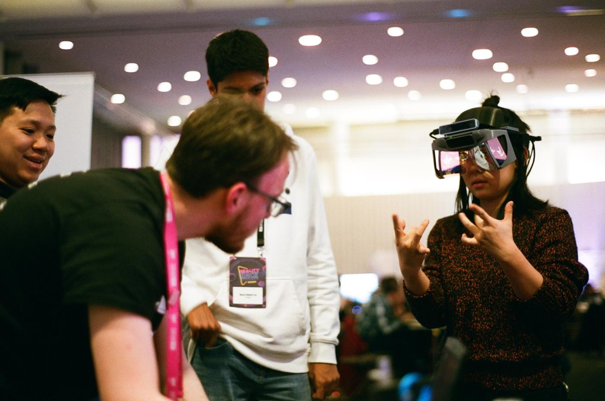
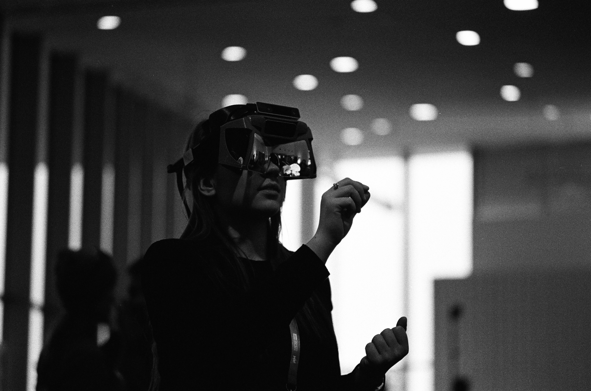

# Project North Star

## Welcome to the [Community Built Documentation](https://project-north-star.gitbook.io/project-north-star/) for Project North Star!

> _We envision a future where the physical and virtual worlds blends together into a single magical experience. At the heart of this experience is hand tracking, which unlocks interactions uniquely suited to virtual and augmented reality.   
>   
> To explore the boundaries of interactive design in AR, we created and open sourced Project North Star, which drove us to push beyond the limitations of existing systems."  
>   
> -Leap Motion_

Project North __Star is an open source Augmented Reality headset originally designed by LeapMotion \(now UltraLeap\) in June, 2018. The headset is almost entirely 3D printable, with a handful of components like reflectors, circuit boards, cables, sensors and screws that need to be sourced seperately. Luckily through the help of Noah Zerkin, all the parts to make North Star headsets are easily accessible through [Smart Prototyping](https://www.smart-prototyping.com/AR-VR-MR-XR/AR-VR-Kits-Bundles).

##   

**Project North Star at MIT Reality Hack 2020**, photo credit: [Matthew Daiter](https://daiter.dev/)

There's also a large community of Northstar developers and builders on Discord, you can join the server and share your build, ask questions, or get help with your projects by [joining the server](https://discord.gg/9TtZhb4)! The project has had many variations since its inception, by both UltraLeap and the open source community. Some of the variations are documented and linked to here, but visit the discord server for more to-the-moment information.

## Variations

So! We've got a few different builds, as you've probably guessed. To clear up any ambiguity from the outset, Release 1 was an internal release. Release 2, the first public open-source release \(sometimes referred to as the initial release\), was in 2018. Release 3 came in 2019 and improved on the mechanical design in many ways. As shown from the cable below, the newly released Deck X is probably what new users will want to start with. It uses an integrated circuit board to reduce cables from the headset to just two, \(USB 3 /mini DP\), by combining usb devices into a custom built usb hub + arduino module. 

| Name | Status | Date | Developer | Spatial Tracking | Headgear | Bracket |
| :--- | :--- | :--- | :--- | :--- | :--- | :--- |
| [Deck X](mechanical/combine-reality-deck-x/) | Stable | 21 AUG 2020 | CombineReality | Realsense T261 | 3.1 | 3.2 |
| Release 3-2 | Dev | TBD | LeapMotion | Realsense T265 | 3.2 | 3.2 |
| [Release 3-1](mechanical/release-3/) | Stable | 3 APR 2019 | LeapMotion | Realsense T265 | 3.1 | 3.1 |
| [Release 3](mechanical/release-3/) | Stable | 23 JAN 2019 | LeapMotion | Realsense T265 | 3 | 3 |
| Release 2 | Outdated | 6 JUN 2018 | LeapMotion | N/A | 1 | 1 |





