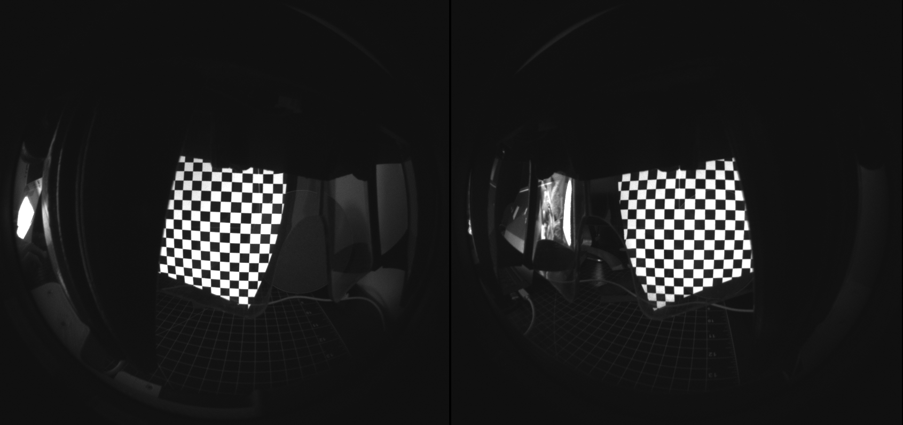

# 2D Optical Calibration


These Modules require python 3.7 in order to work



The realsense T265 & T261 can only be used with on application at a time, you'll have to close realsense viewer. 




Above: A video walking you through the 2D calibration process for northstar.

## Setup

1. Download the **Feat-Gen-2-software** branch of the following repo: [https://github.com/BryanChrisBrown/ProjectNorthStar/tree/feat-gen-2-software](https://github.com/BryanChrisBrown/ProjectNorthStar/tree/feat-gen-2-software)
2. Setup python with the following dependencies:  `1) Pyrealsense2 2) opencv-contrib-python 3) numpy`
3. Print the calibration stand and [intel realsense mount](https://drive.google.com/file/d/1emnKXaevUyY_jEExWeCeesK_AUDbetcu/view?usp=sharing) **m3x12mm** screws to mount the t265 itself.

## Calibrating your headset

Run through the following steps to calibrate your headset. 

* **captureGraycodes.py -** run **`python captureGraycodes.py`** to run this script
* Ensure that your headset is placed on the calibration stand, with the stand's camera looking through it where the users' eyes will be. 
* On line 44 there is a line of code that changes the window offset for the graycode generator.    This example here moves the window 1920 pixels to the right, and 0 up and down. You'll want the X value \(1920\) to be your main monitor's width in pixels. `cv2.moveWindow ("Graycode Viewport", 1920, 0)`  
* It helps to place a piece of cloth over the rig to shield the cameras + headset from ambient light. 
* The sequence of binary codes will culminate in a 0-1 UV mapping, saved to **"./WidthCalibration.png" "./HeightCalibration.png"** in your main folder. 
* **calibrateGraycodes.py**
* Running this script will fit a 3rd-Degree 2D Polynomial to the left and right "eye"'s X and Y distortions. 
* This polynomial will map from each display's 0-1 UV Coordinates to rectilinear coordinates \(where a 3D ray direction is just \(x, y, 1.0\)\).

When you are finished, you may paste the output of the calibrateGraycodes.py into [this diagnostic shadertoy](https://www.shadertoy.com/view/wsscD4) to check for alignment. Additionally, ensure that your headset is plugged in and displaying imagery from your desktop. Running this script will display a sequence of gray codes on your North Star, capturing them at the same time.  

Additionally, there should be a `NorthStarCalibration.json` in this directory which you may use in the Unity implementation.

