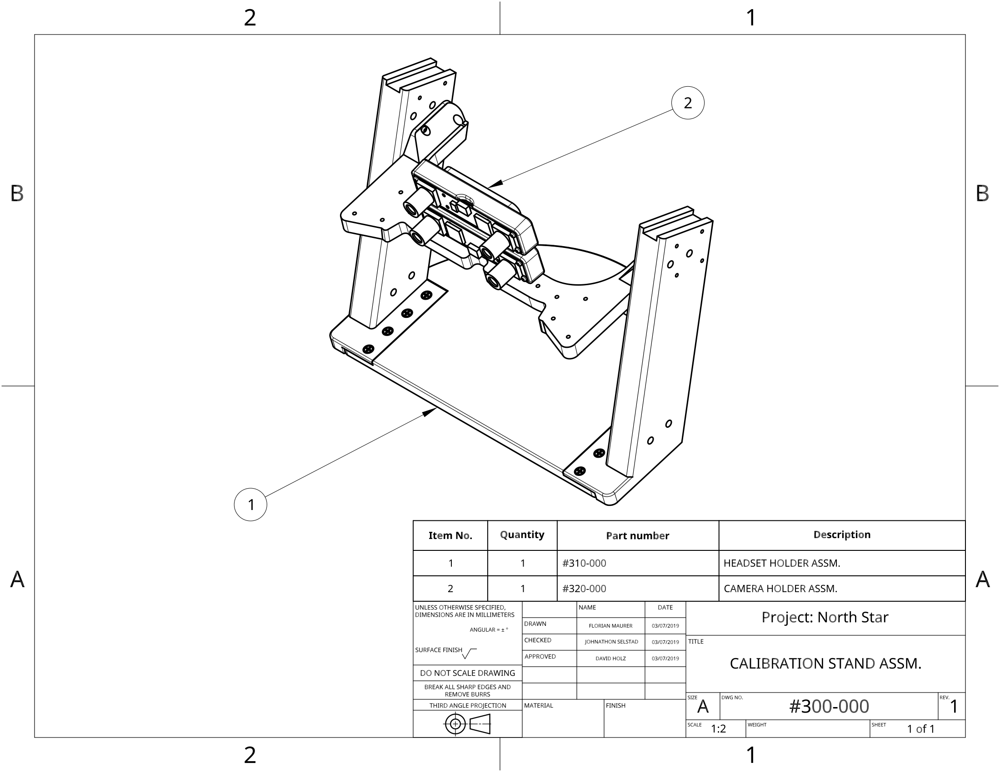
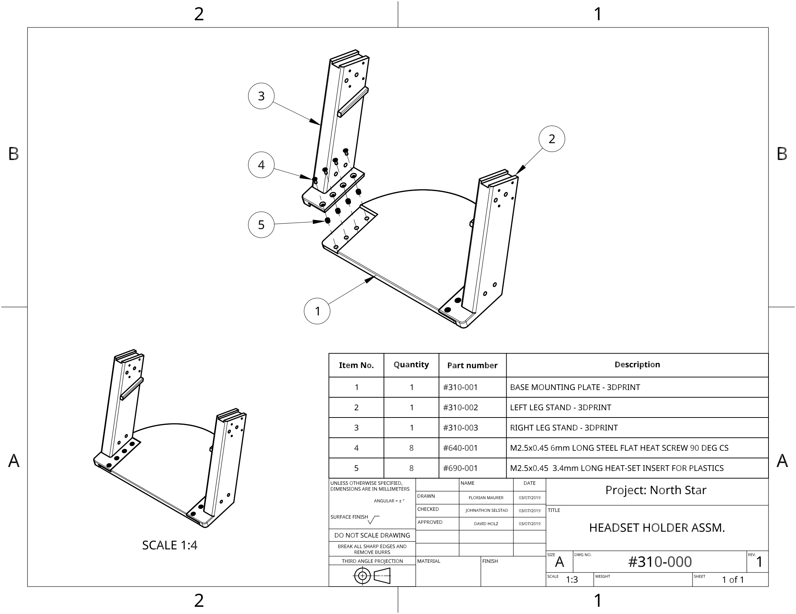
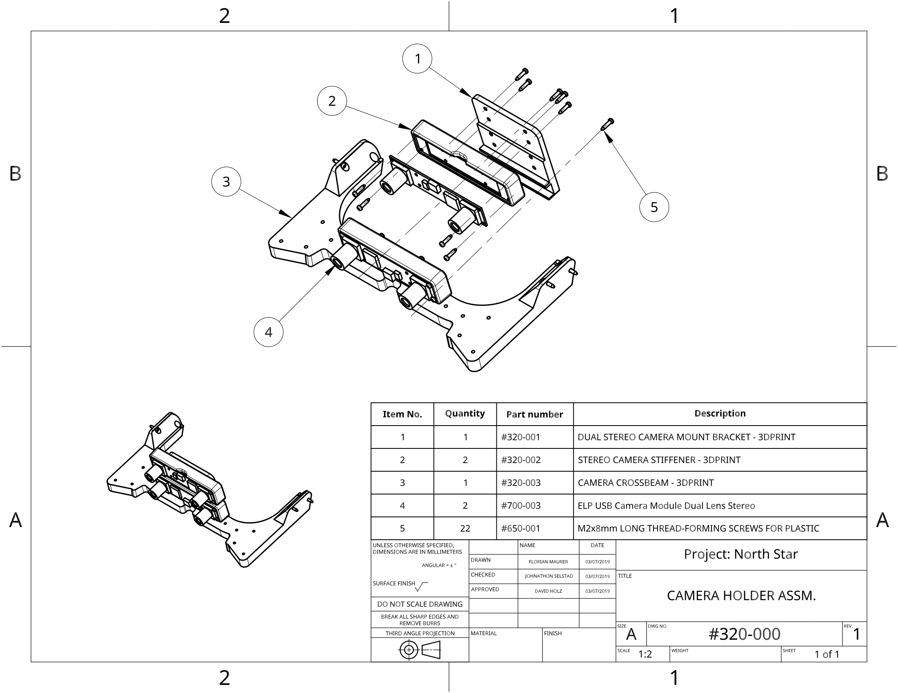

# Calibration Stand Guide - Leap Motion

| Part number | Quantity | Description | Source |
| :--- | :--- | :--- | :--- |
| \#310-001 | 1 | BASE MOUNTING PLATE  | 3DPRINT |
| \#310-002 | 1 | LEFT LEFT STAND | 3DPRINT |
| \#310-003 | 1 | RIGHT LEFT STAND | 3DPRINT |
| \#320-001 | 1 | DUAL STEREO CAMERA MOUNT BRACKET | 3DPRINT |
| \#320-002 | 2 | STEREO CAMERA STIFFENER | 3DPRINT |
| \#320-003 | 1 | CAMERA CROSSBEAM | 3DPRINT |
| \#640-001 | 8 | M2.5x0.45 6mm LONG STEEL FLAT HEAT SCREW 90 DEG CS | [McMaster \#91420a016](https://www.mcmaster.com/91420a016) |
| \#650-001 | 22 | M2x8mm LONG THREAD-FORMING SCREWS FOR PLASTIC | [McMaster \#96817a212](https://www.mcmaster.com/96817a212) |
| \#690-001 | 8 | M2.5x0.45  3.4mm LONG HEAT-SET INSERT FOR PLASTICS | [McMaster \#94180a321](https://www.mcmaster.com/94180a321) |
| \#700-003 | 2 | ELP USB CAMERA MODULE DUAL LENS STEREO | [Amazon](https://www.amazon.com/ELP-Industrial-Application-Synchronized-ELP-960P2CAM-V90-VC/dp/B078TDLHCP/) |

