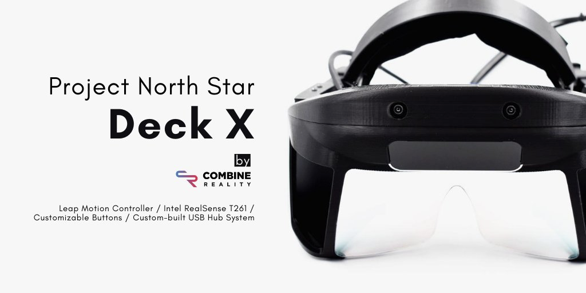

# Combine Reality Deck X

The Combine Reality Deck X is a variant of Release 3 designed by Noah Zerkin's team at smart-prototyping. It includes a new hub called "The Integrator" which includes microSD card storage, an Arduino and USB hub, an embedded Intel Realsense t261 sensor, and a control board for adjusting ergonomics like IPD and eye relief. 


Deck X Kits are available through ****[**Smart Prototyping**](https://www.smart-prototyping.com/AR-VR-MR-XR/AR-VR-Kits-Bundles)\*\*\*\*



\*\*\*\*[**GitHub Repository**](https://github.com/CombineReality/ProjectNorthStar)


## 3D Printing Variants

Please note that the github repo for the CombineReality Deck X headset has three versions.   
[**3.1.1**](https://github.com/CombineReality/ProjectNorthStar/tree/master/Mechanical/CombineReality_Variants/3.1.1)  
The Prints in the 3.1.1 folder are intended for users who want to upgrade their existing 3.1 headset and also use a t265 sensor.  
[**Deck X - with Heat Set Inserts**](https://github.com/CombineReality/ProjectNorthStar/tree/master/Mechanical/CombineReality_Variants/Deck_X)  
 The Prints in the Deck X folder are intended for most users who are building a headset using the t261 sensor.   
[**Deck X - without Heat Set Inserts**](https://github.com/CombineReality/ProjectNorthStar/tree/master/Mechanical/CombineReality_Variants/Deck_X_Without_Threaded_Inserts)  
There's also a version of the Deck X for users that don't want to use heat set inserts. Please note that if you only intend to adjust or rebuild the headset once or twice maximum. Taking the headset apart and putting it back together without heat set inserts will cause the mounting points to deteriorate over time. 





