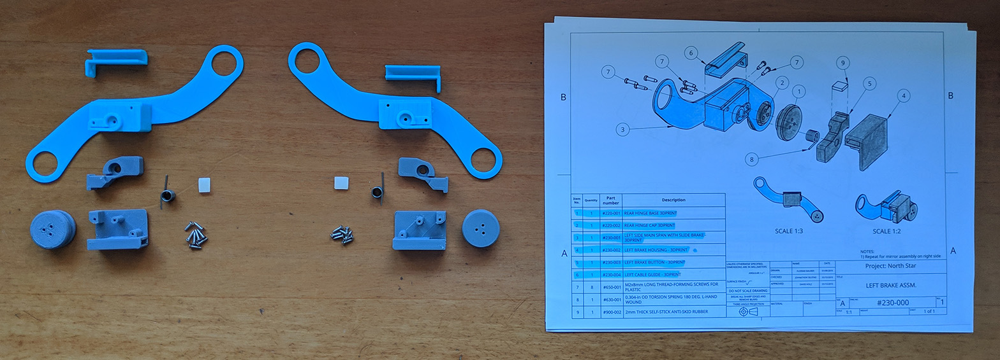

# Headgear Assembly Guide

The Deck X headset uses the same headgear from release 3. The build process is documented below with photos.

### Contribution & Credits

This page was contributed by [**Guillermo Guillesanbri**](https://guillesanbri.github.io/)****

If we take a look at the first page with instructions starting from the end of the document, we will find the 230-000 instructions.

These parts were updated not long ago, so if you have downloaded them recently, you should be missing the two cable-guides on the top of the picture above and have a reinforced version of 230-001/240-001.

.png>)

When assembling the headgear, take into account that even if the assembly drawing doesn’t show it, you have to put the welding headgear between the hinge parts.

.png>)

To put the spring in place, you will have to turn it 180 degrees loading it, this can be easily done by putting the spring in place in both parts and turning around one of them.

.png>)

.png>)

First, we need to bend the forehead headgear span, to do this, it’s recommended to turn the heated bed of your 3D printer to 70 °C, which is enough to shape the part if you don’t have access to a heated print bed, don’t worry, other options are:

* Using a Heat Gun.
* Using hot water.
* Anything that gets the piece to \~70 °C.

You can now shape the piece with a mannequin head or your own head if you cover your skin to avoid first degree burns (not really, just be careful). [**Demo video by Florian Maurer.**](https://www.youtube.com/watch?v=FLRj4\_IuamE)****

Once we have the piece bent, it’s time to wrap up the foam, to do so, I did this, **I’m not 100% sure this is the best/correct way to do it**, but it worked out fine for me. Take into account that the felt-like side is the smoothest one and should be the one in contact with your forehead.

.png>)

.png>)

.png>)

Now, let’s put the hinges in place, again, remember to put pieces 230-000 and 240-000 between the two pieces of each hinge. I found it easier to lock in place the hinge base (shown in the picture below) and screw the cap on top.

.png>)

You should have now the headgear assembled, just like the pictures below, with **two differences**, the **reinforced parts** and the **absence of the cable guides**.

.png>)

.png>)
