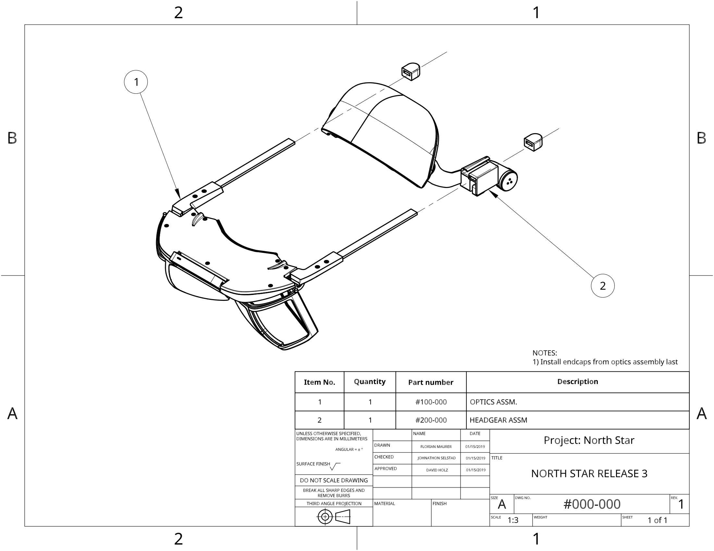
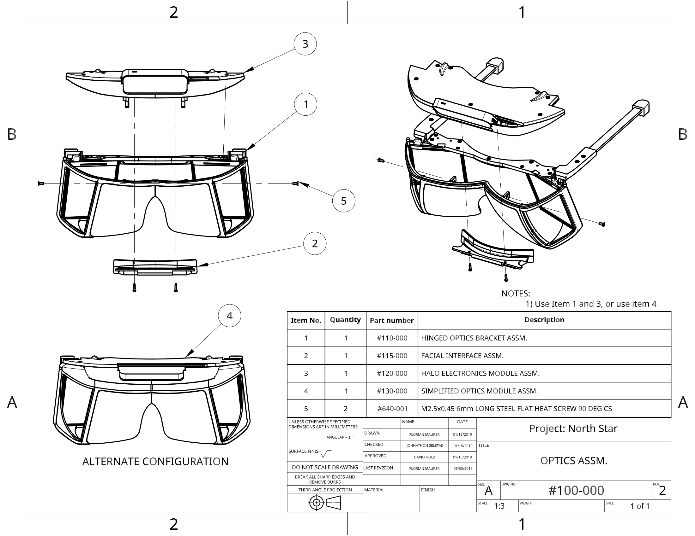
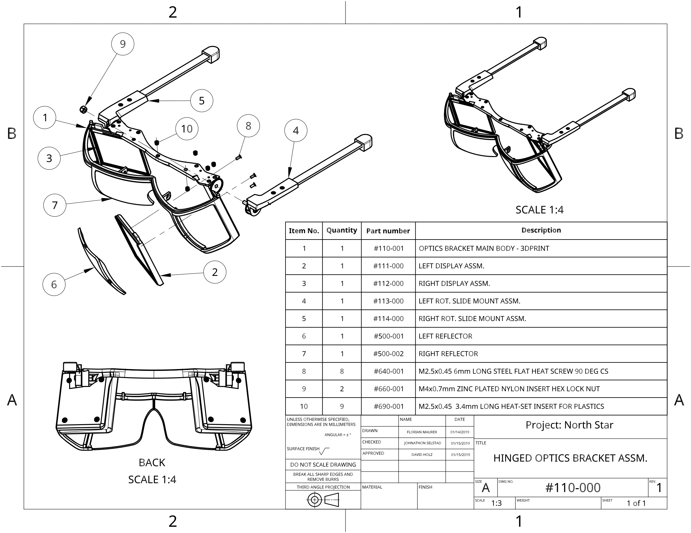
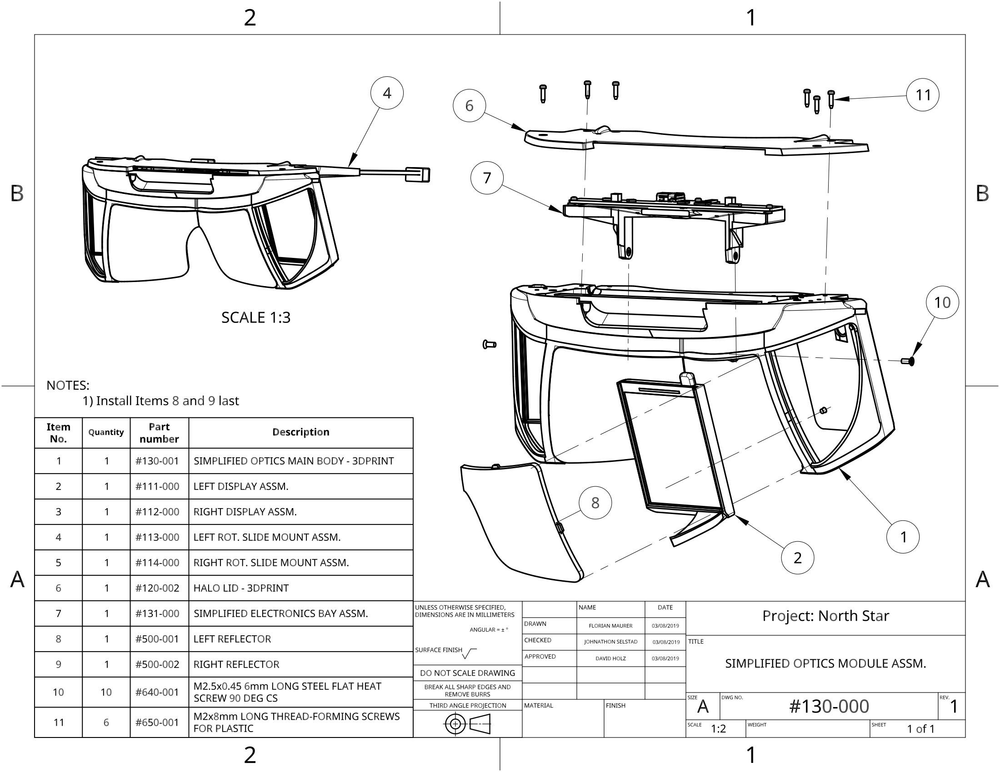
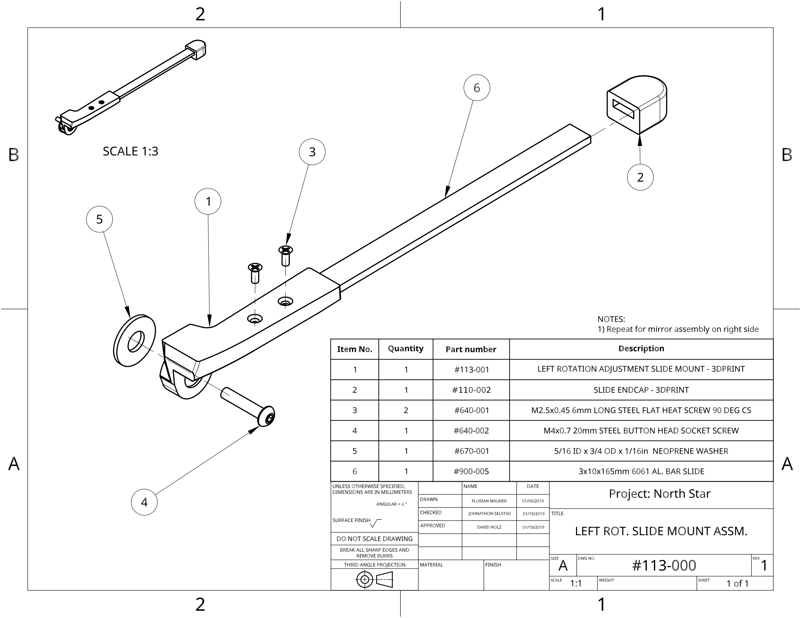
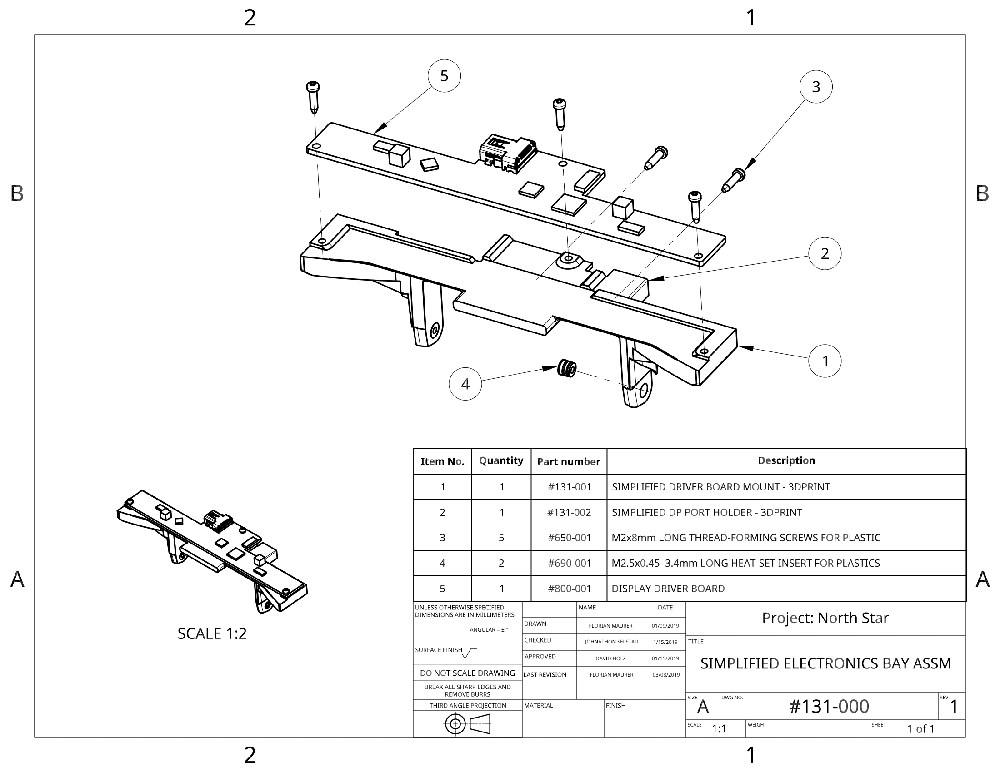
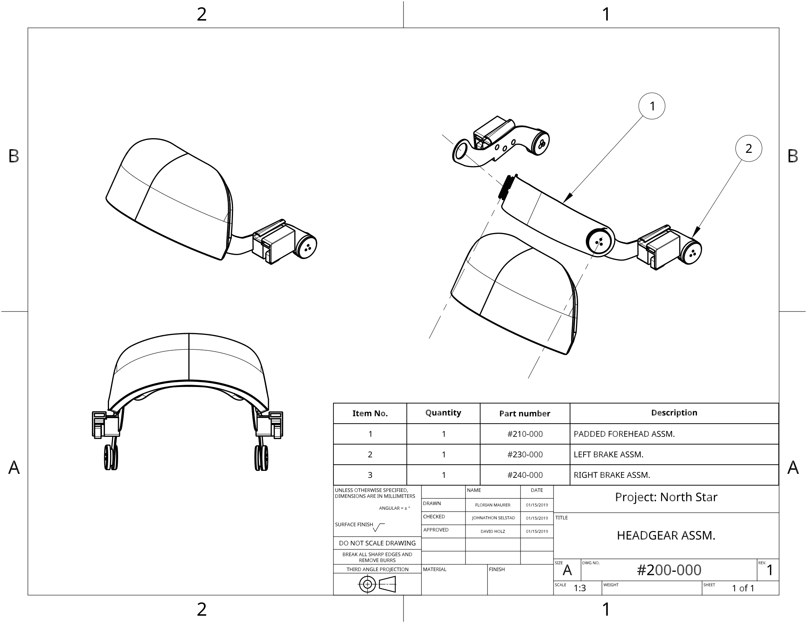
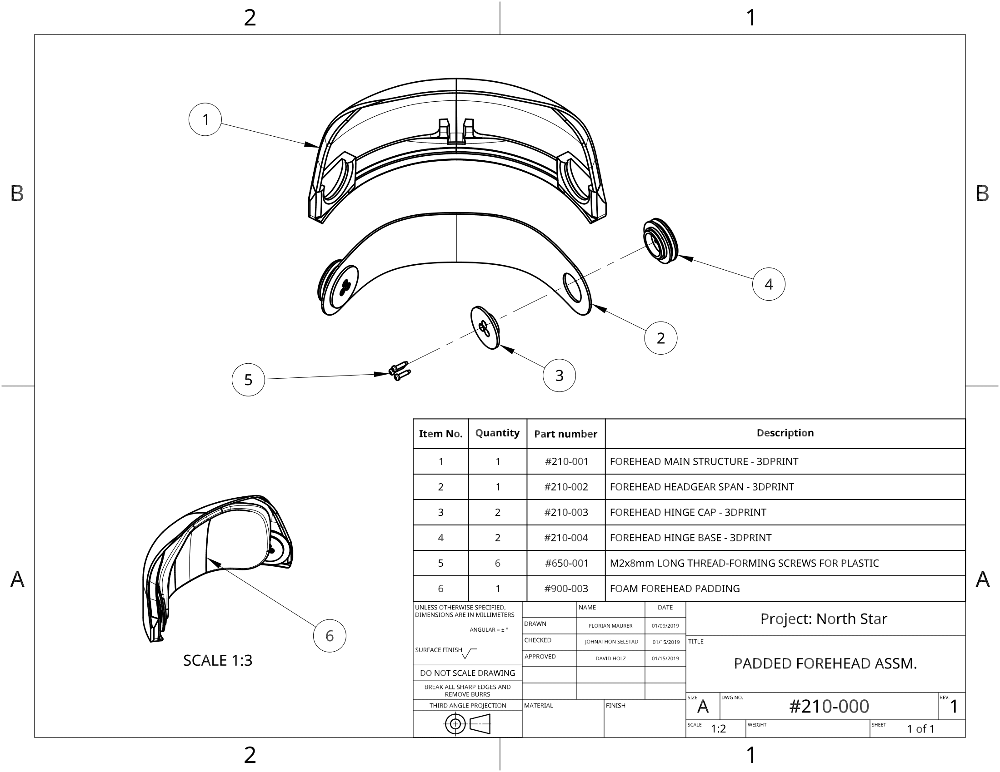
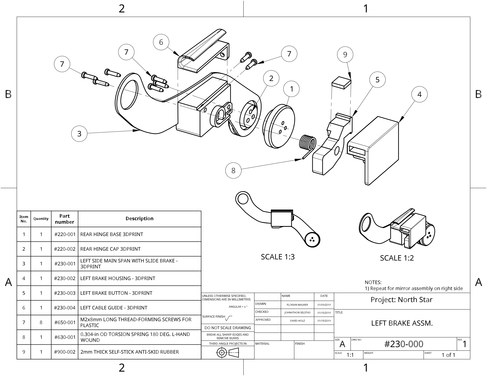
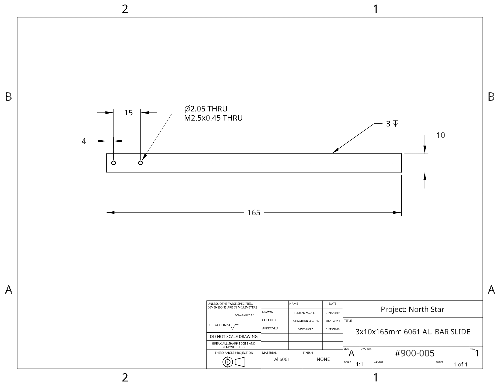

# Headset Assembly Instructions

This guide is also available as a PDF:



## 000-000

## 100-000

## 110-000

## 130-000

## 111-000

## 113-000

## 120-000

## 121-000

## 131-000

## 200-000

## 210-000

## 230-000

## 900-005

