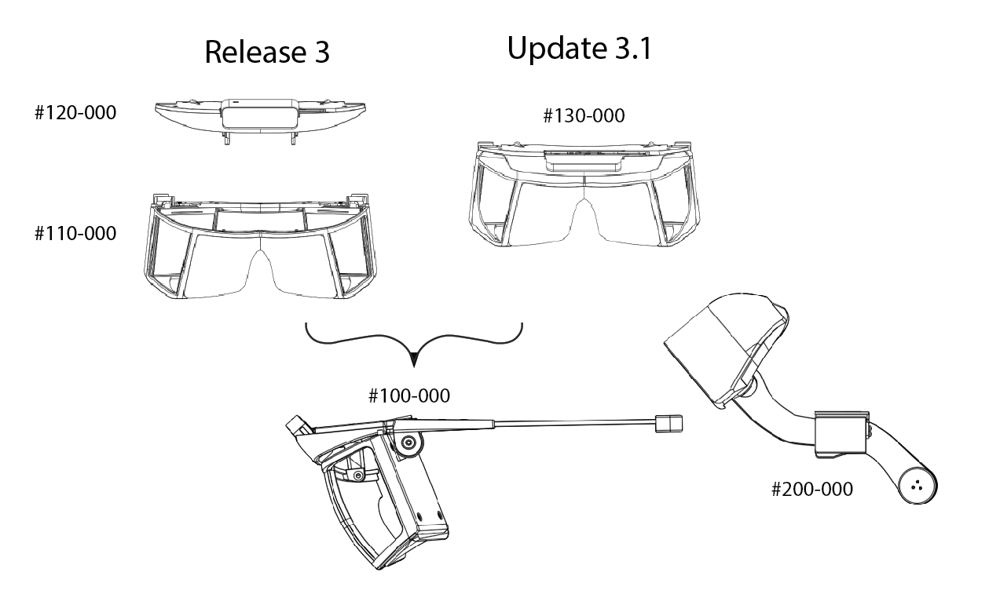

# North Star Release 3

Mechanical Release 3 bundles together all the lessons we learned into a new set of 3D files and drawings. Its main objective is to be more inviting, less hacked together, and more reliable. The design includes more adjustments and mechanisms for a larger variety of heads and facial geometries. Overall, the assembly is lighter, more balanced, and stiffer.The parts were designed for an FDM style 3D printer


This is a work in progress. This is not a finished guide, nor end-user friendly.\
Major sections are missing. Assembly requires care and patience. Nothing worth having is ever easy.


## Getting Started

Open the [Headset Mechanical Assembly](headset-assembly.md) and construct each sub-assembly as illustrated. A full list of the parts needed can be found in the [Headset Bill of Materials (BOM)](headset-bom.md). Not all sub-assemblies are required as there are multiple designs to choose from. Additionally, the CAD files are included in STEP format to help design new parts.

## Design Overview

The headset consists of two basic sections: the optics [`#100-000`](headset-assembly.md#100-000) and headgear [`#200-000`](headset-assembly.md#120-000). The optics subassembly currently has two variants: Release 3 optics and Update 3-1 (i.e. the simplified optics assembly). The headgear assembly utilizes the rear adjustment mechanism from a Miller branded welder’s helmet, but several models can be made to work.

### Optics assembly: Release 3 vs 3-1

Functionally, the two optics assemblies are the same. Release 3 is closer to the original design aesthetic and it’s marginally (8g) more lightweight. On the other hand, Update 3-1 halves the print time by removing the need for supports on the sides. Overall, the simplified 3-1 bracket is easier to print with lower print failures and stiffer too. It’s recommended to start with the simplified Release 3-1 optics assembly for the first build. See drawing [`#100-000`](headset-assembly.md#100-000) for more information.

## Notes on 3D printed parts

*
* All development was done using [eSun's PLA Pro / PLA+](https://www.amazon.com/eSUN-1-75mm-Printer-Filament-Colors/dp/B07K642RQP) filament. We've found it to be strong, easy to print, and have great surface finish.
* A build plate of approximately 250x200mm is recommended for the largest parts
* Parts may need to be rotated to align with print bed.
* Some parts have optimized versions (labeled “FDM OPTIMIZED”) with extra plastic tabs that need removing. These versions aid in minimizing warping and gripping the print surface.


.25mm layer height, 2 perimeter shells, 15% infill\
Filament: eSun PLA Pro (PLA+)\
3D Printer: MakerGear M2\
Slicer: Simplify 3D


### Installing heat set inserts

Several parts in the optics assembly use brass inserts for increased clamping load and the ability to swap out the components multiple times without wear. These inserts need to be heated above the plastic's melting point and pressed into the plastic. It's recommended to use an installation tip designed for brass inserts.


Installing inserts using soldering iron


Demonstration of using a soldering iron to install brass inserts. The wire cutters are used to prevent the insert from pulling back out when not using an installation tip.

Parts that require inserts:


Display trays (4 inserts each) - [`#111-00x`](headset-assembly.md#111-000) and [`#112-00x`](headset-assembly.md#110-000)\
Driver board mount (2 inserts) - [`#121-001`](headset-assembly.md#121-000)/[`#131-001`](headset-assembly.md#131-000)\`\`


Installing brass inserts into the optics bracket is optional. They're intended as mounting points for future testing.

### Bending thermoplastics

The headgear assembly includes parts that print flat but bend to fasten to each other. Although not necessary, it’s suggested to drape these parts around a form while the 3D print is still soft from the heated print bed. This minimizes strain inside the plastic and prolongs the life of the part.


Example using mannequin head


Preheating the print bed to 70C softens a print enough to shape the part

.jpg>)
