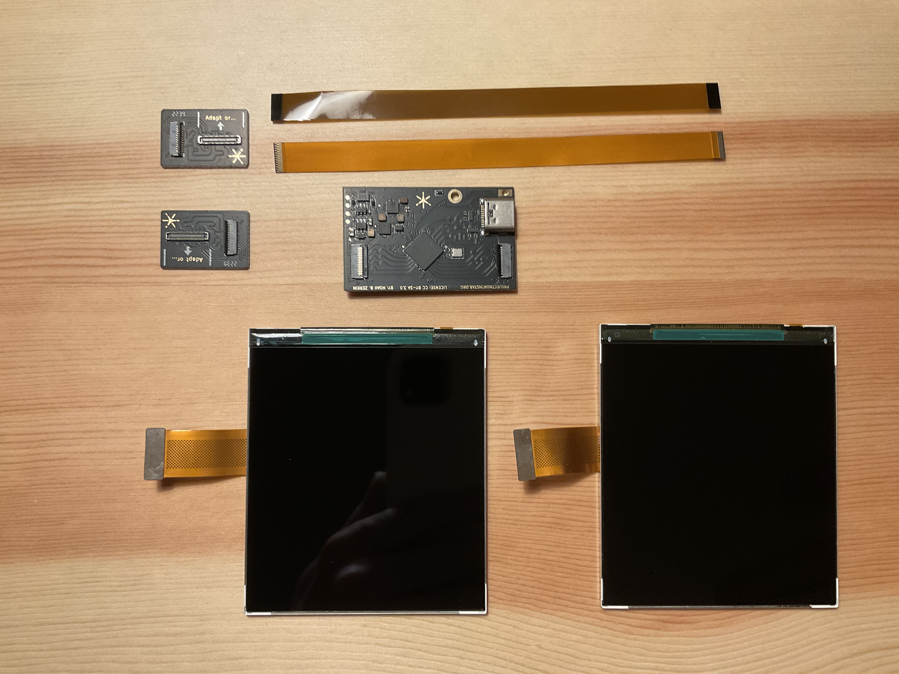
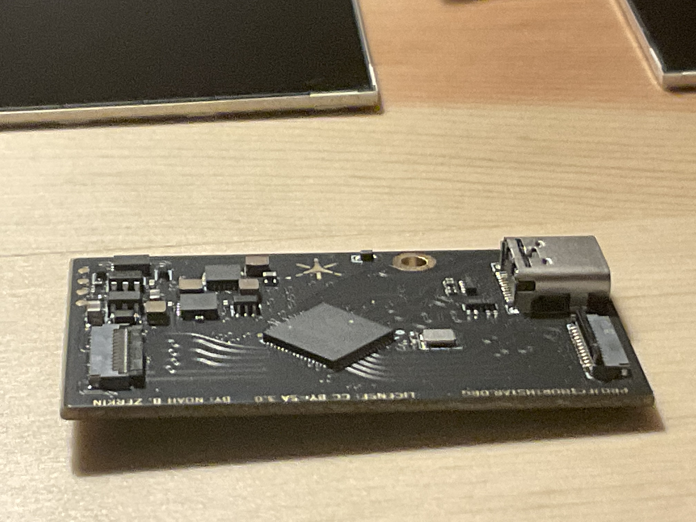
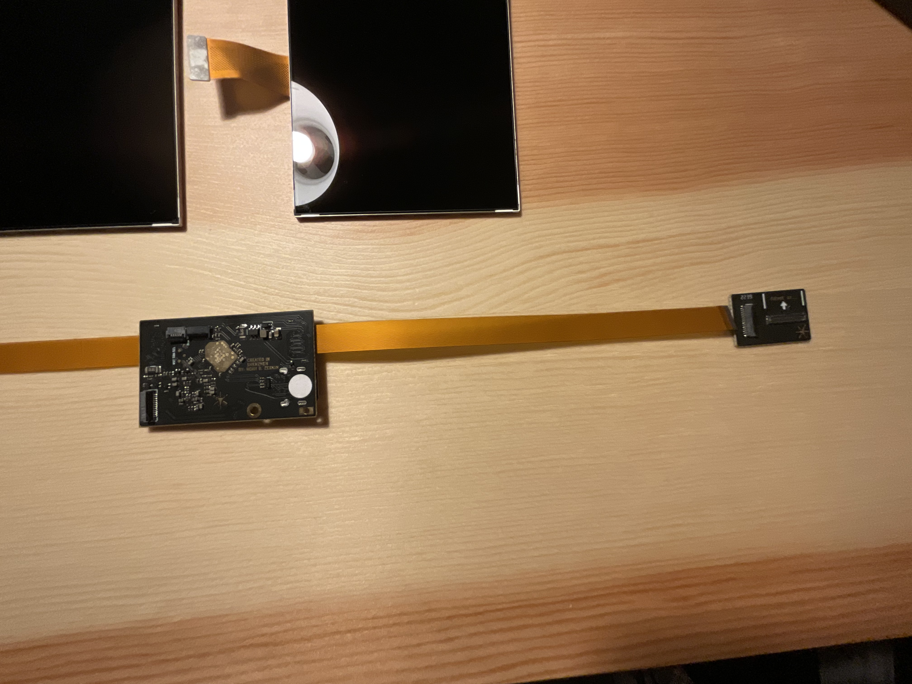
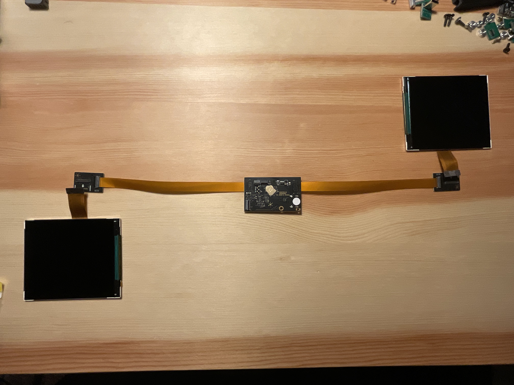

# ✨ Assembly Guide


### Please Read the Instructions before beginning assembly! Northstar is an advanced electronics system and must be assembled with care!  TLDR:  <mark style="color:orange;">If you plug something in backwards, it will break!</mark>&#x20;



You can get next generation Northstar kits from Combine Reality: [https://shop.combinereality.com](https://shop.combinereality.com).


##

<figure><figcaption>
A rendering of the next generation Northstar HMD, without enclosure
</figcaption></figure>

## Displays and Display Driver Board


### You must take care when connecting the display ribbon cables. Please follow these instructions carefully!&#x20;


The display assembly for Northstar Next kits include:&#x20;

<figure><figcaption>
The Northstar Display components
</figcaption></figure>

| Part Name                         | Quantity |
| --------------------------------- | -------- |
| **Northstar Next Driver Board**   | 1        |
| **Northstar Next Adapter Boards** | 2        |
| **BOE 3.5" 1440x1600 Displays**   | 2        |
| **Display Adapter Ribbon Cables** | 2        |

The new display driver board supports two BOE 1440x1600 displays at \~90hz. The board has a USB-C input, and a 12pin serial output to connect to the USB hub board included in the next gen kits.&#x20;

### Connecting the ribbon cables to the driver board.&#x20;

The Driver board and break out boards use special [FPC ](../glossary.md#fpc)connectors. These connectors have the pins wrap around the connector, meaning that either side can make contact with the ribbon cable pins.&#x20;

The ribbon connections on the Driver board and Adapter boards use an FPC connection called a **Backflip Latch**. The gates have pins on both the top and bottom of the connector. **This means you **_<mark style="color:orange;">**must**</mark>_** connect the display ribbon cable as shown in the instructions, otherwise you will short your displays.**&#x20;

In order to connect the ribbon cables to the adapter boards correctly you must do so as pictured below:&#x20;



The gates on the Driver board and Adapter boards should be opened. In the photo below the backflip latch on the right of the driver board is open, and the backflip latch on the left is closed.&#x20;

Move both latches to the open position.&#x20;

<figure><figcaption></figcaption></figure>



Ensure that the ribbon cables are facing down so the pins are facing the [PCB ](../glossary.md#pcb)on the circuit board. \
\
Ensure that the ribbon cable is fully inserted in the backflip latch, it should be fully parallel like shown below. Once inserted, close the latch.

<figure><figcaption></figcaption></figure>




### <mark style="color:orange;">This step is important, if you do not follow this you will break your displays.</mark>&#x20;

Flip the driver board over so that the gold diamond is facing upwards and the USB-C port is facing down. \
\
Then line up the Adapter board as shown, the pins of the ribbon cable should now be facing up. \
\
Connect the ribbon cable in the same manner you did on the driver board.&#x20;

<figure><figcaption></figcaption></figure>



Align the displays so that they point in the same direction the arrows are pointing on the adapter board.&#x20;

Then line up the pins and push firmly to connect the displays to the FPC connector.&#x20;

<figure><figcaption></figcaption></figure>



**Double Check your work.**&#x20;

Take a moment to examine each connection.&#x20;

<figure><figcaption></figcaption></figure>

 

<figure><figcaption></figcaption></figure>

Are the cables fully inserted in each connector?&#x20;

Are the backflip latches closed and fully secure?

Are the cables in the correct orientation? \
\
It’s always better to be patient and double check your work then to rush and power on a system haphazardly.&#x20;



Power on your Display Driver board by connecting the USB-C cable. \
\
Be careful when handling the displays as the USB-C cable will likely try to pull the driver board and displays along with it.\
\
The driver board has no power button, so connecting the cable will power it on automatically. \
\
The Display Driver board will automatically negotiate a handshake with your computer, and the displays will automatically turn on and show up as display. For now we just care about the displays turning on and showing an image, so don't worry too much about settings. \
\
You should see your desktop background on the displays. \
\
If you do not see an image on the displays or they don't turn on, ensure your computer is capable of outputting video over USB-C, this is commonly referred to as DP-Alt-Mode.&#x20;



