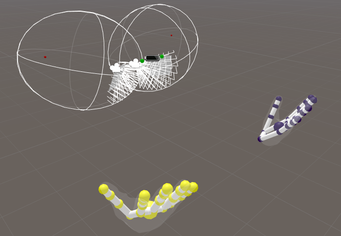

# Unity


Make sure to check the [**Getting Started with Software**](getting-started-with-software.md) page before following the instructions on this page. 


## Compatibility

**These assets require the** [**Multi-Device Beta Service**](https://github.com/leapmotion/UnityModules/tree/feat-multi-device/Multidevice%20Service) **to display hands.**

These assets are dependent on [Release 4.4.0](https://github.com/leapmotion/UnityModules/pull/1010) of the [Leap Motion Unity Modules](https://github.com/leapmotion/UnityModules) \(included in the package\).

## Getting Started:

* Make sure your North Star AR Headset is plugged in
* In windows display settings make sure the headset is showing at the correct resolution \(2880x1600\) and is to the right of the main monitor.
* Create a new Project in Unity 2018.4 LTS
* Import "LeapAR.unitypackage" from the [Github Repo](https://github.com/leapmotion/ProjectNorthStar/blob/master/Software/LeapAR.unitypackage)
* Navigate to `LeapMotion/North Star/Scenes/NorthStar.unity`
* Click on the `ARCameraRig` game object and look for the `WindowOffsetManager` component
* Here, you can adjust the X and Y Shift that should be applied to the Unity Game View for it to appear on the North Star's display
* When you're satisfied with the placement; press "Move Game View To Headset"
* With the Game View on the Headset, you should be able to preview your experience in play mode!

  Key Code Shortcuts in `NorthStar.unity` \(in the Editor with the Game View in focus and playing\)

* `C` to Toggle Visibility of Calibration Bars

## Calibrating your Headset

We have included a pre-built version of the internal calibration tool. We can make no guarantees about the accuracy of the process in DIY environments; this pipeline is built from multiple stages, each with multiple points of failure. Included in the .zip file are a python script for calibrating the calibration cameras, a checkerboard .pdf to be used with that, and Windows-based Calibrator exe, and a readme describing how to execute the entire process.

